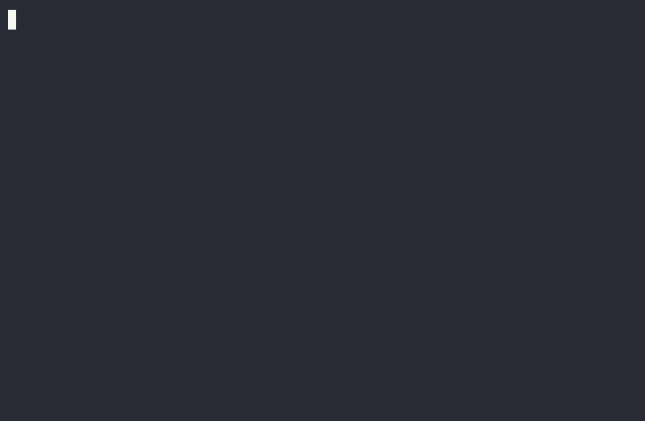

# hermes-plugin-evalroute

Route a task to the right **(model, reasoning effort) arm** before you start.
Built around the evalroute procedure — a one-file harness that measures
**cost per verified success** per task lane (vendored at `harness/evalroute.py`
so this repo is self-contained: measure, then serve the results) — this
plugin turns its output into a route table with provenance on every row:
pick the lane, pick the model, pick the effort, as data.

- `/route <task>` — classify a task into a lane, get a route card (model,
  effort, escalation, provenance) before the first turn. Works in CLI,
  gateway, and desktop.
- `evalroute_route` tool — the same card as a model-facing tool, so the agent
  consults it when planning (including for subagent delegation).
- `hermes evalroute install-routes` — install one reasoning-effort default per
  model. Shared models can serve lanes at different efforts, so follow the
  card's explicit `/reasoning` step when its lane differs. `--dry-run` shows
  the config diff.
- First-turn sniff (`pre_llm_call` hook) — on the first turn of a session,
  a high-confidence lane/model mismatch gets one advisory line suggesting
  `/route`. Silent when you're already on the right model. CLI/TUI/desktop
  only; never blocks, never switches anything.
- `runners/hermes-shim.py` — the `api: "cmd"` adapter for running Hermes
  itself as an evalroute arm (see below).
- `routes_from_report.py` — regenerate `data/routes.yaml` from measured
  `evalroute.py report --csv` output, preserving classifier fields and
  unmeasured rows.
- Bundled skill `evalroute-routing` — when to route, and the gotchas
  (switch before turn 1; subagents get `delegation.reasoning_effort`).

The table began with a **2026-09-26 priors snapshot** (public benchmarks,
many vendor-run). Three lanes now have small measured batches; the others
remain marked `priors`. Replace those rows only after your own controlled data,
and keep each row's `provenance` visible.

## The loop, end to end



One command classifies the task and prints the arm (`route`), the card
tells you what to run and how to check the lane (`next:`), and one command
closes the loop (`rate`). The GIF is a real capture of v0.3.2 installed at
its release pin, on a DL/ML lane task: the `basis: measured` line and the
gonogo stamp are live output — 10 shared tasks, both arms at 100% coverage,
$p = 1.000$, a cost decision on this sample — and the `logged:` line confirms
which row the rating closed. Commands and output are verbatim; only the
typing animation is authored. The demo pair was then pruned from the labels
file — demo records never live in the ledger. Two things have changed since
that capture: the paired interval it shows, `[+0.0%, +0.0%]`, came from a
Wald interval that collapses when the arms never disagree; gonogo 0.3 now
reports `[-33.4%, +33.4%]` on the same stored cases. And the card now prints
a `route id:` line. The route table and `rate` output below reflect the
current code.

## Where evalroute sits

evalroute is one tile of a small ecosystem that takes a task from
*which model?* to *ship it or not*:

```
your task ──► evalroute ─ choose a (model, effort) arm;
                │         measured where available, priors marked
                ▼
your cases ──► thomas ── train on labels (encoder) or score_text (RL);
                │         evaluate on untouched cases with gonogo
                ▼
              gonogo ── ship it, test a threshold on fresh cases, or walk away
```

- **[evalroute](https://github.com/keppy/hermes-plugin-evalroute)**
  (this repo) — the routing layer: classify the task, hand back the arm
  with measured costs where available and priors otherwise; collect ratings
  to prioritize the next controlled batch.
- **[gonogo](https://github.com/keppy/gonogo)** — the decision layer, and
  the root of the map. Any agent, your real cases, a target; the verdict
  comes with the interval behind it.
- **[thomas](https://github.com/keppy/thomas)** — the training harness. RL
  shares `score_text` across training and held-out evaluation; encoder SFT
  instead learns labels and needs a separate held-out evaluation.
- **The Hermes plugins** — the same three, inside your agent's session:
  this one (`/route` before the first turn),
  [gonogo](https://github.com/keppy/hermes-plugin-gonogo) for decisions, and
  [thomas](https://github.com/keppy/hermes-plugin-thomas) with a human approval
  hook on its training tool.

## What this changes for Hermes

Hermes ships one default (model, effort) per user; every task pays the same
arm regardless of shape. This plugin makes that a per-task decision, backed
by three things a default can't have:

- **Measured routes.** Three lanes measured with the evalroute harness
  (10 tasks x 3 samples per arm; four routine-coding, five DL/ML, five
  alignment arms, of which only four alignment arms have graded samples:
  119 graded, 30 judge-pending, and one missing cell). Raw API
  and judge cost in the vendored rows totals **$3.0590051**, excluding
  verification time across routine coding, DL/ML research engineering,
  and alignment reasoning. Every winner was
  statistically indistinguishable from its runner-up at n=10 (McNemar, via
  gonogo) — the empirical paired gap is zero, but the conservative interval
  spans [-33.4%, +33.4%]; $p=1$ is not a population equivalence test.
  All-coverage lanes have a ceiling on this
  taskset; the routes choose cost among observed ties, not quality parity.
  The alignment judge has no blind checker audit; its 30 pending Qwen outputs
  are excluded from the route comparison. No quality claim spans that arm.
  The historical v1 run records omit model IDs; the arm-name-to-ID mapping is
  the vendored `models.json`, not an ID echoed by those records.
  Routine coding overturned the
  priors' vendor pick: glm-5.3-flash at medium effort covered every task
  at $0.00005/success, 2.4–3.9x cheaper than the V4.1 Flash arms at equal
  coverage.
- **Provenance states.** Every row is `priors`, `observed`, or `measured`.
  Nothing hypothesis-shaped masquerades as a result — the card prints the
  row's provenance verbatim, statistical stamp included.
- **A flywheel.** `/route` logs a recommendation; `/model` and `/reasoning`
  log unverified, process-global switch diagnostics. `/rate pass|fail` records
  an outcome, optionally with a user-confirmed model and effort — never an
  automatic arm attribution. Facets distinguish a `long-doc` /
  `domain-dlml` / `tier-hard` task from an undifferentiated research label.

The platform adoption path needs no core changes: a route table is data plus
config writes (`agent.reasoning_overrides`), and the effort half of routing
already ships in Hermes. A community-maintained measured table is this same
plugin with better data in it.

## Classification: rules first, LLM when weak

The classifier's first layer is deterministic keyword rules over
`data/routes.yaml` — free, no API calls — but rules alone misroute
paraphrase ("manage life, writing, and researchy tasks" has zero keyword
signal) and negation ("not usually hard math though" used to count as a
math hit; the rules now guard negated keywords). So routing is two-layer:

1. **Strong rules** (2+ distinct keyword hits on the winning lane) — trusted
   outright, no LLM call.
2. **Weak signal** (0-1 hits) — one structured call via `ctx.llm`
   (the host's own model and auth; works under the default trust policy,
   no new credentials, but **consumes tokens and may incur provider charges**).
   The LLM judges what the work IS — a description of
   an assistant's duties routes to `orchestration`, not to whatever nouns
   appear.

The card always prints which layer decided: `rules match`, `LLM fallback`,
or `no keyword hit - defaulted`. If the LLM call fails (offline, trust
denied), the weak rules result stands and the card says so. Pin manually
with `/route --lane <id>` when you know better.

## Facets: labels with dimensions

A lane is the routing decision; facets are the label. Every route also
captures the task's shape along three axes, defined in `data/facets.yaml`:

- **input-shape**: `long-doc` | `interactive`
- **domain**: `domain-dlml` | `domain-alignment` | `domain-math` | `domain-prose` | `domain-research`
- **demand-tier**: `tier-routine` | `tier-hard` | `tier-orchestration`

So "audit my RL training plan files" is recorded as `long-doc +
domain-dlml + tier-hard` — three facts about one task — instead of one
collapsed lane. The rules layer derives facets from keyword evidence
(conservative: only lanes that drew hits claim facets); the LLM fallback
names them semantically in the same structured call.

When a task claims facets on multiple axes, the card describes the
conjunction. **Facets do not alter the chosen arm**: the lane classifier
selects the arm; no domain/tier precedence is implemented:

```
facets: long-doc + domain-dlml (descriptive conjunction; lane chooses arm)
```

Facet conjunctions aggregate in `routes_from_labels.py`, so the
high-dimensional nodes — "how do long-doc x dl-ml tasks fare on arm X?" —
fill in from daily use without controlled-batch spend.

## Install

```bash
hermes plugins install keppy/hermes-plugin-evalroute
hermes plugins enable evalroute
hermes evalroute install-routes --dry-run   # review, then drop --dry-run
```

Requires nothing beyond `pyyaml`. No `requires_env` — there are no
credentials to gate.

## The route table

`data/routes.yaml` — one row per lane: `id`, `keywords` (the rule layer),
`model`, `effort`, `escalation`, `provenance`, `notes`. Lane taxonomy is the
union of the two source tables (9 lanes); where they disagreed (long-doc
merged into web-research in one, orchestration only in the other) both are
kept as distinct lanes. Model ids must match `/model` spelling exactly.

### Regenerating from measured data

```bash
# in the harness venv (openai + anthropic; it stays out of the Hermes venv)
python harness/evalroute.py run -m models.json -t tasks.jsonl -k 3
python harness/evalroute.py report -o runs.jsonl -t tasks.jsonl -k 3 --csv report.csv
python routes_from_report.py --csv report.csv --runs runs.jsonl \
  --models models.json --k 3 --out data/routes.generated.yaml
```

`report` needs the matching `--tasks` file: it checks each run's prompt/checker
contract and treats missing declared tasks as incomplete. Without that file it
prints diagnostics but selects no route. The vendored `report.csv` files under
`examples/artifacts/` were regenerated from their `runs.jsonl` and
`tasks.jsonl` with this harness and carry the `complete` column. A legacy CSV
(no `complete` column) is refused even with `--runs`, since the old winner
selection may have ignored pending cells; regenerate it the same way.

The harness is vendored so the loop is complete inside one repo: write
tasksets (deterministic `python` checkers where possible — validate every
checker against a reference solution before paid runs), run k samples per
arm, report, then flip the lane's row. `routes_from_report.py` applies the
report's own routing rule (coverage-gated lowest all-in $/success), stamps
`provenance: measured ...` with a gonogo McNemar stamp when the winner and
runner-up shared cases, preserves each lane's `keywords`/`match_hint`/
`escalation`/`notes`, and carries unmeasured lanes over verbatim —
regeneration never silently deletes a route. The tier-a tasksets and runs
that produced the current measured lanes are under `examples/artifacts/`
(sets: `tasks.jsonl`; raw run records: `runs.jsonl`).

Inspect the generated YAML before replacing `data/routes.yaml`. `--models`
maps harness arm names such as `glm-5.3@high` to `/model` IDs; omission is
only safe if the CSV already contains routable IDs. `--k` defaults to 3;
graded sample counts must divide evenly by k, or the generator refuses to
invent a task count. The harness v2 resume key includes the full task and
checker spec, model price/config and effective max tokens, plus the judge
configuration when used. It keeps legacy JSONL reportable, but reporting
mixed legacy/v2 or multiple prompt/checker versions together fails explicitly.

## The Hermes shim (`api: "cmd"` arms)

To run Hermes itself as an evalroute arm (agentic cells):

```json
{"name": "hermes-glm@high", "api": "cmd", "effort": "high",
 "cmd": "python runners/hermes-shim.py --model {model} --effort {effort} --prompt {prompt_file}",
 "model": "z-ai/glm-5.3", "in": 0.91, "out": 2.86, "timeout": 3600}
```

The shim wraps `hermes -z` (one-shot; tools, memory, AGENTS.md loaded as
normal; approvals auto-bypassed), reads the usage report (`--usage-file`),
and emits the contract evalroute expects: the answer on stdout, then one
JSON last line `{"text": ..., "usage": {"inp", "out", "cache_read"}}`. A
non-zero hermes exit becomes an `error` field in that line (the harness
records an error row and retries on the next `run`); the shim itself always
exits 0. `--system` is prepended to the prompt. `--hermes PATH` overrides
the executable (tests use this to point at a fake — no real runs).

## Known limitations

- **The rule layer is keywords.** Deterministic, free, and misses
  paraphrase — which is what the LLM fallback is for. The fallback's
  quality tracks whatever model the session is on; it costs one small
  structured call (temp 0, 256 tokens) only when rules are weak.
- **The plugin cannot switch the model for you.** `/route` prints the card;
  you run `/model <id>`. Run it before turn 1 — mid-session switches re-read
  the whole context at full input price.
- **One effort slot per model id** (`agent.reasoning_overrides`); when a model
  serves two lanes, `install-routes` keeps the higher effort. A lower-effort
  lane's card explicitly prints `/reasoning <lane-effort>` after `/model`,
  because the installed override alone would run the wrong arm.
- **Provenance is priors until you measure.** Several rows are explicitly
  untested/unmeasured/contested; the card prints the provenance verbatim so
  nobody mistakes a hypothesis for a result.
- **The evalroute harness stays out of the Hermes venv.** It's vendored at
  `harness/evalroute.py` (run it in its own venv with `openai`/`anthropic`;
  `EVALROUTE_PYTHON` points the plugin's runners at that interpreter).
  This plugin itself requires nothing beyond `pyyaml`.
- **The sniff hook is advisory only.** It speaks when the classifier is
  confident and the session's model disagrees with the lane's route; it
  never rewrites, blocks, or switches.

## Roadmap

- **In progress:** flip the remaining 6 priors lanes to measured. Three done
  (routine-coding, dl-ml, alignment — 2026-09-27, $3.0590051 recorded API
  and judge cost); each needs a
  10-task set with checkers that discriminate (pre-spend validation
  against a reference solution catches broken fixtures before paid runs).
- **Theory stretch — classifier fine-tune.** Train a lane classifier with
  the thomas training harness, fed by flywheel labels (task text → lane,
  plus the `--lane` corrections). LLM fallback becomes the last resort;
  different kinds of users could run different locally-finetuned
  classifiers. Needs a hand-checked experiment first (label volume,
  class balance, per-user vs. global training) before any training spend.
  Not scheduled until the flywheel has enough labels to train on.
- **Live but tiny:** `/route` + `/rate` have two ratings from one maintainer.
  `/model` and `/reasoning` switches are unverified diagnostics, not actual
  arm assignments. The raw ledger stays local; these observations can
  prioritize a later controlled batch, not validate a route.
- Gonogo is wired (McNemar stamps on measured rows, decide() verdicts on
  observed rows). Remaining: thomas integration — lane as a field on the
  Case shape, so intake → lane → route → (model, effort) arm closes the
  loop.

## Flywheel: labels from daily workflow

The controlled harness is not the only source of data. As you use `/route`
in daily sessions, the plugin quietly builds an observational dataset:

- **`/route`** logs the assignment (lane, recommended arm, method,
  confidence, facets) to `<hermes home>/evalroute/labels.jsonl` — the
  task text you typed is the label.
- **`/model` or `/reasoning` after a route** logs a process-global switch
  observation. Without a session join it is not a verified route rejection
  and cannot supply the actual arm for a flip.
- **`/rate pass|fail [--route-id <id>] [--lane <id>] [--model <id> --effort <level>] [--note ...]`**
  labels the outcome when you finish. Use both arm flags to self-report what
  actually ran; otherwise the arm stays unknown. `--lane` corrects a lane;
  `skip` discards that route. Prefer `--route-id` in overlapping sessions.
- Nothing else is recorded: no response bodies or turn telemetry. Task text,
  switch arguments and optional notes are recorded. The last-seen model is
  process-global memory only and is **not** assigned to a route as fact.

The ledger is **profile-wide**, not session-scoped: Hermes command hooks do
not supply a reliable session ID for `/route` and `/rate`. The card prints a
route ID; when tasks overlap, select it with `--route-id`. Without it, `/rate`
consumes the latest pending route in that profile, which may be another
session's. `/model` and `/reasoning` observations are process-global candidates,
not proof of which model served a given route; only an explicit `/rate
--model ... --effort ...` confirms an observational arm. To replace a pinned
card, use `/route --lane <lane> --replace-route-id <old-id> <same task>`;
identical task text alone never consumes another pending route. Inspect the
route ID, task and lane before trusting a label.

**Continuing across sessions (turn caps).** A task that outlives its session —
the turn limit hits, the terminal closes mid-task — is a continuation, not a
new route. The row being labeled is (task, arm), not (task, session):

- Prefer staying in the session: `continue: <what remains>` gets a fresh
  iteration budget, and the arm is session-scoped and persists.
- Otherwise `hermes -c` continues the same conversation, or paste the capped
  session's final turn as the new session's opener.
- Never `/route` the continuation. If the new session is a different task,
  `/rate skip --route-id <id>` clears that specific pending row first if it
  belongs to you; don't consume another user's pending row.
- Steer as much as you like. The observed layer is defined as
  daily-workflow-with-a-human-in-the-loop; a directive continuation is normal
  operation, and it matches a detailed original prompt better than a bare
  "continue" — which quietly tests prompt-luck instead of the arm. Measured
  rows are untouched: they come from fixed-prompt, fresh-context harness cells.
- Put the methodology in the note: `--note "completed across two sessions
  (turn cap), directive continuation"`. The label records neither cost nor
  session boundaries, and a session-spanning pass re-reads the accumulated
  context at full input price — the note is where that lives.

**Turning labels into route data:** `python routes_from_labels.py` prints
per-lane, per-arm pass rates, lane corrections, and facet conjunction
outcomes; `--apply` writes `data/routes.observed.yaml`. Observed rows carry
honest, weaker provenance:

```
observed 23 outcomes, same-maintainer observational single-arm, pass 78%, 2026-10-30;
not independent trials or a controlled comparison
```

and only where the lane has no `measured` row — observational data can contest
a priors row, never overwrite a measured one. When gonogo is installed, each
observed row also carries its decide() verdict, so a row with 3 outcomes reads
as INSUFFICIENT_EVIDENCE rather than a pass rate someone will trust. The one
provisional flip threshold is 3 user-confirmed arm failures on the recommended
arm and 2 user-confirmed wins on another observed arm. This is still same-maintainer, non-randomized
evidence — review it and verify with paired controlled cases before treating
it as a quality comparison. The two same-arm outcomes in the old snapshot
never justify a route flip.

**Publishing the labels.** The live ledger stays local and append-only; do
not check raw `data/flywheel/labels.jsonl` into a public repo. Task text and
notes can expose paths and private project details even without response
bodies. The previously committed snapshot is removed from the current tree
and ignored going forward; **it remains retrievable from published Git
history** unless the repository owner separately coordinates a history
rewrite and downstream cache/clone cleanup. Do not claim retroactive erasure.
